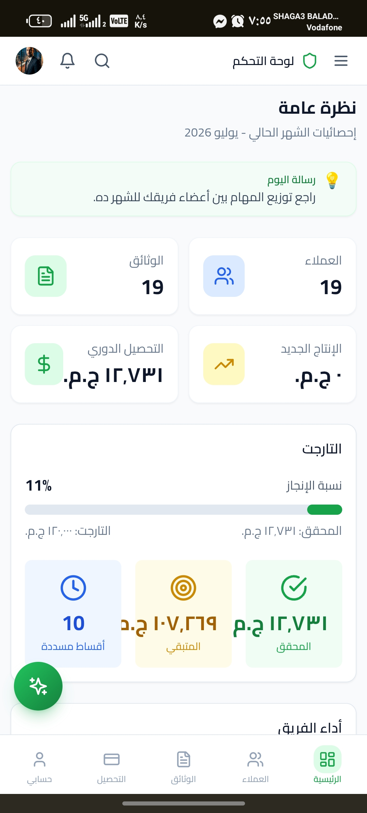
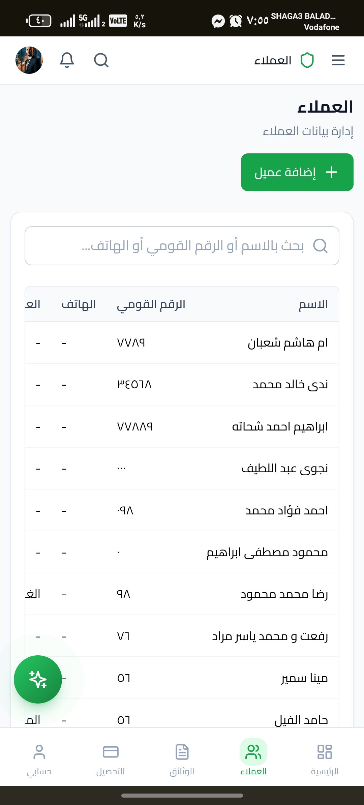
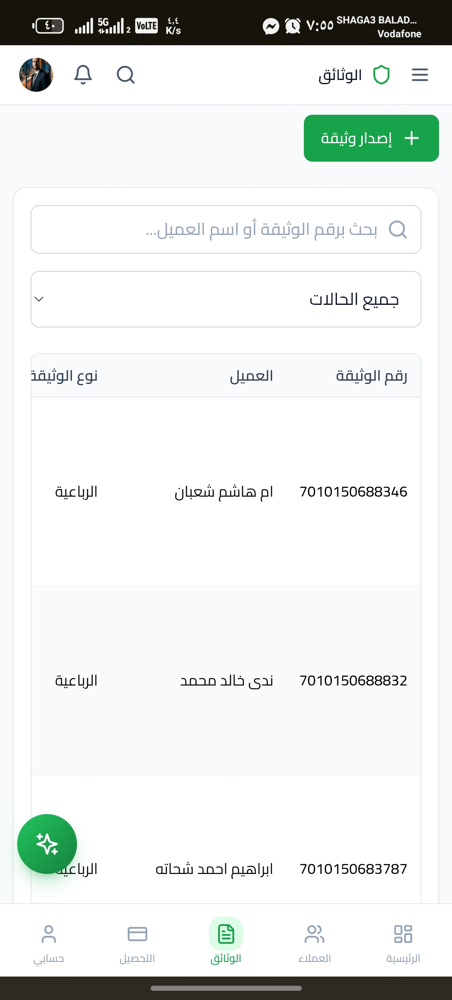
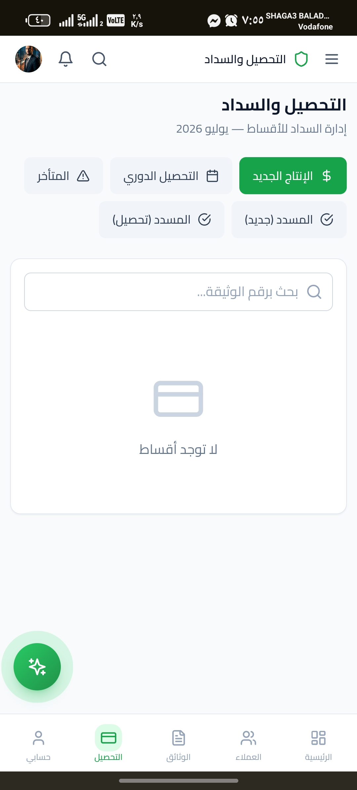
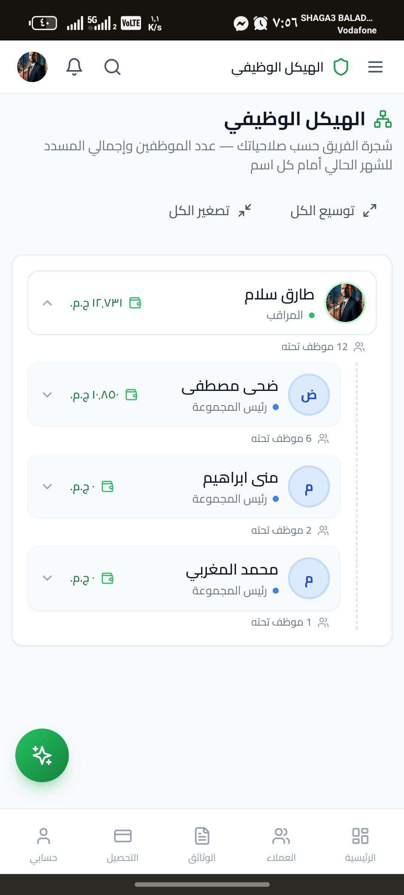
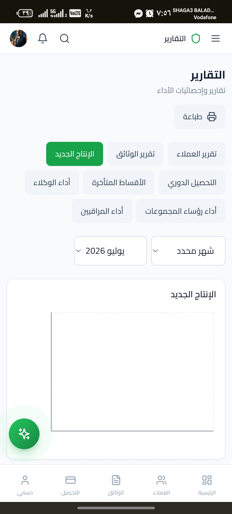

<div align="center">

# CRM Insurance Project


**A production-ready open-source CRM platform for insurance organizations.**

</div>

---

## Overview

CRM Insurance Project is designed to help insurance companies manage:

- **Customers** — Complete customer profiles and data management
- **Policies** — Insurance policy issuance and tracking
- **Collections** — Installment and payment collection management
- **Sales Teams** — Team performance monitoring and coordination
- **Organizational Structure** — Hierarchical team management
- **Financial Reports** — Monthly closing and performance analytics
- **Notifications** — Automated alerts and task distribution
- **Role-Based Permissions** — Granular access control (RBAC)

The project demonstrates enterprise application architecture using modern web technologies.

---

## 📸 Screenshots

| Dashboard | Customers |
|:---:|:---:|
|  |  |

| Policies | Collections |
|:---:|:---:|
|  |  |

| Organizational Structure | Reports |
|:---:|:---:|
|  |  |

---

## Features

- Authentication
- Role-Based Access Control (RBAC)
- Customer Management
- Collection Management
- Dashboard & KPIs
- Reports
- Activity Log
- Organizational Structure
- Settings Management
- Responsive Design
- Supabase Integration
- Offline-friendly architecture
- Progressive Web App (PWA)

---

## Tech Stack

| Category | Technology |
|:---|:---|
| **Framework** | React |
| **Language** | TypeScript |
| **Build Tool** | Vite |
| **Backend** | Supabase |
| **Styling** | Tailwind CSS |

---

## Project Structure

```
src/
├── components/
├── features/
├── hooks/
├── lib/
├── pages/
└── supabase/
```

---

## Installation

```bash
npm install
npm run dev
```

---

## Production Build

```bash
npm run build
```

---

## Roadmap

- Unit Testing
- Performance Optimization
- AI Assistant Improvements
- Better Offline Support
- Multi-language Support
- Mobile Version

---

## Contributing

Contributions are welcome.

Please open an Issue before submitting major changes.

---

## License

MIT License
